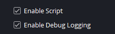
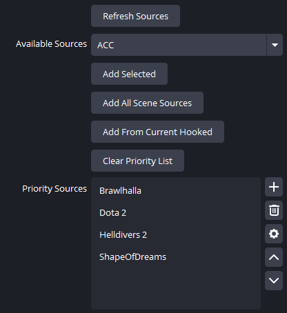
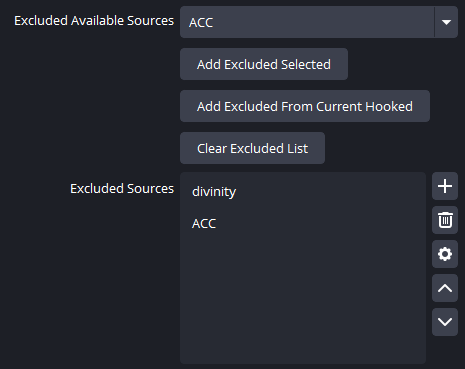
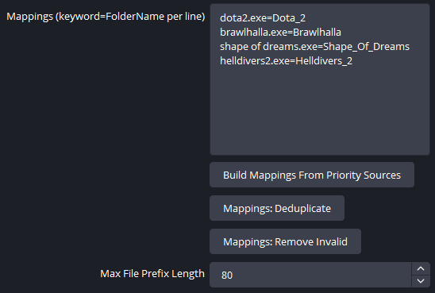
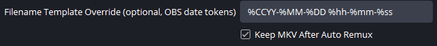
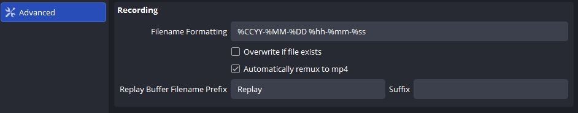
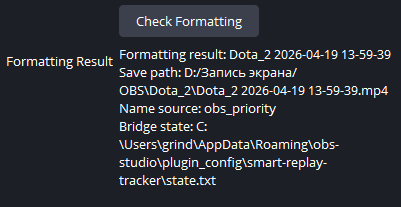

# Replay File Organizer Configuration Guide

This guide explains how to configure `replay-file-organizer.lua` in OBS.

If you only want the short version:

- `smart-replay-tracker.dll` watches the last relevant active app and safely moves the saved replay file.
- `replay-file-organizer.lua` decides **what the clip should be called and which folder it should go to**.

If you only care about standard recording names, the script can still be useful on its own.
The plugin is specifically needed for the Replay Buffer workflow.

That makes these three areas the most important parts of the configuration:

- `Priority Sources`
- `Excluded Sources`
- `Mappings`

`Excluded Sources` and `Mappings` are especially important, because they are what make the result predictable instead of random.

## How the config works

The plugin and the script work together like this:

1. The plugin watches the last relevant active app and writes that information to its state file.
2. When you save Replay Buffer, the script reads the plugin state.
3. The script then looks at the OBS sources you added to `Priority Sources`.
4. If one of those sources is active and usable, the script tries to get app information from it:

   - executable
   - window title
   - source name

5. The script applies your `Mappings`.
6. Any source that appears in `Excluded Sources` is ignored completely.
7. The script builds the target folder name, file name prefix, and preview text.
8. The plugin moves the saved replay file to the final destination after OBS finishes saving it.

If OBS `Auto Remux` is enabled, the final moved file may be `mp4` only. That is expected and does not mean the rename failed.

## Basic switches



### Enable Script

Turns the Lua script on or off.

If this is disabled, the script stops handling naming logic and replay routing.

### Enable Debug Logging

Adds more detailed information to the OBS log.

This is useful when:

- the wrong game is being selected
- the wrong folder is being chosen
- you want to see whether the script is using OBS source data or plugin state

For normal daily use, you can keep it off.

## What "hooked" means here

Some OBS sources can expose the executable or window information of the app they are capturing. In practice, this is what people usually mean here by a source being "hooked" or by OBS having a usable hook for that source.

That is why the script works best with sources such as:

- `Game Capture`
- `Window Capture`
- `Application Audio Capture` / `wasapi_process_output_capture`

If OBS can see the executable or title of a game through one of your sources, the script has much more reliable data to work with.

## Where the game name comes from

The script tries to decide the name in this order:

1. It checks the plugin state for the last relevant app before the replay save.
2. It tries to match that app against your active OBS sources.
3. If a `Mappings` rule matches, that rule wins.
4. If no mapping matches, it tries to build a name automatically from:

   - executable
   - window title
   - source name

5. If nothing reliable is found, it falls back to `Desktop`.

## Priority Sources



### What this section is for

`Priority Sources` is the main list of sources the script trusts first.

If several sources are active at the same time, the script checks this list before falling back to a broader scene scan.

### Why order matters

The order of `Priority Sources` matters.

If several sources could match, the ones higher in the list are checked first. So if a game source should win over something else, keep it higher.

### Controls in this section

#### Refresh Sources

Refreshes the `Available Sources` list from the current OBS scene.

Use this after:

- adding a new source
- renaming a source
- switching to another scene

#### Available Sources

This is the dropdown list of sources found in the current scene.

You choose a source here before adding it to `Priority Sources`.

#### Add Selected

Adds the selected source from `Available Sources` to `Priority Sources`.

If the same source was previously excluded, it is removed from `Excluded Sources`.

#### Add All Scene Sources

Adds every source from the current scene to `Priority Sources`.

This is useful for a quick first pass, but it often adds too much. In most real setups you will still want to clean up the list afterwards.

#### Add From Current Hooked

Adds only the sources that are currently active and exposing usable app information to OBS.

This is often one of the best buttons for initial setup:

1. launch the game
2. make sure its OBS source is actually active
3. click `Add From Current Hooked`

That usually gives you a cleaner starting list than adding everything from the scene.

#### Clear Priority List

Removes everything from `Priority Sources`.

### The list controls on the right

The list itself has the usual OBS editable-list buttons on the right:

- `+` adds a row manually
- trash deletes the selected row
- gear opens OBS list actions
- up moves the selected row higher
- down moves the selected row lower

The most useful actions here are usually delete and reorder.

## Excluded Sources



### What this section is for

`Excluded Sources` is a hard deny-list.

If a source is in `Excluded Sources`, the script is not allowed to use it when deciding the replay name, even if:

- the source is active
- the source is hooked
- the source is visible
- the source looks technically valid

This is one of the most important parts of the whole config.

### Why Excluded Sources matters so much

Without a good exclude list, the script can sometimes pick something that is active but should never define the replay name, such as:

- Discord
- Chrome
- desktop capture
- browser audio
- other helper or utility sources

In other words, `Excluded Sources` protects the naming logic from false positives.

### When you should exclude something

A source usually belongs in `Excluded Sources` if it should **never** decide the name of a replay clip.

Common examples:

- Discord audio capture
- browser audio capture
- desktop capture
- monitor capture
- other always-on helper sources

### Controls in this section

#### Excluded Available Sources

This is the dropdown list of current scene sources that you can choose to exclude.

#### Add Excluded Selected

Adds the selected source to `Excluded Sources`.

If that source was present in `Priority Sources`, it is removed from the priority list automatically.

This is important: a source should not be both trusted and excluded at the same time.

#### Add Excluded From Current Hooked

Adds all currently hooked sources to `Excluded Sources`.

Use this carefully. It is mainly useful when the sources that are currently hooked are exactly the ones you want to block quickly, such as browser or chat-related sources.

#### Clear Excluded List

Removes everything from `Excluded Sources`.

### The list controls on the right

Like `Priority Sources`, the excluded list has the usual OBS editable-list buttons:

- `+` adds a row manually
- trash deletes the selected row
- gear opens OBS list actions
- up moves the selected row higher
- down moves the selected row lower

### Best practice for Excluded Sources

If a source should **never** be used as the name of a replay clip, do not leave that decision to chance. Put it in `Excluded Sources`.

This is the cleanest way to keep the config stable.

## Mappings



### What Mappings are

`Mappings` are rules written like this:

```text
keyword=FolderName
```

The left side is what the script searches for.
The right side is the clean name you want to use.

### Where the script searches for the keyword

The script checks the keyword against:

- executable
- window title
- source name

The match is a substring match, not necessarily a full exact string.

In practice, the most stable key is usually the executable name.

### Examples

```text
dota2.exe=Dota_2
brawlhalla.exe=Brawlhalla
helldivers2.exe=Helldivers_2
ac2-win64-shipping.exe=ACC
```

### What the right side does

The right side (`FolderName`) becomes the base for:

- the replay folder name
- the replay file prefix

The script also normalizes it into a Windows-safe form:

- invalid filesystem characters are replaced
- repeated separators are cleaned up
- spaces are normalized

### Why Mappings matters so much

`Mappings` is what turns technical process names into clean, stable names on disk.

Without mappings, the script tries to guess a reasonable name automatically from OBS data. That can work, but it is not always the exact name you want.

With mappings, you are telling the script:

- which executable belongs to which game
- what the folder should be called
- what the filename prefix should look like

This makes the result much more predictable.

### Controls in this section

#### Build Mappings From Priority Sources

This is one of the most useful buttons in the script.

It goes through your `Priority Sources`, tries to read their executable information, and creates or updates mapping lines automatically.

If the executable is not available from the live hook, the script also tries to get it from the OBS source settings.

This makes it a very good first-pass setup button:

1. build a clean `Priority Sources` list
2. click `Build Mappings From Priority Sources`
3. manually polish the generated names on the right side

#### Mappings: Deduplicate

Removes duplicate mapping keys.

If the same key appears several times, the script keeps a single final rule.

#### Mappings: Remove Invalid

Removes broken or incomplete lines, such as:

- empty lines
- malformed rules
- entries without a left side
- entries without a right side

### Best practice for Mappings

The most practical workflow is usually:

1. build `Priority Sources`
2. set up `Excluded Sources`
3. click `Build Mappings From Priority Sources`
4. manually edit the right side so the final names look exactly how you want

## Max File Prefix Length

Limits how long the replay name prefix is allowed to be.

If the generated name is too long, the script trims it to this value.

`80` is usually a safe and reasonable value.

## Filename Template Override



This optional field lets you enter the filename date/time template manually instead of relying only on the current OBS `FilenameFormatting` value.

This field is mainly useful for **Replay Buffer naming consistency**.

For standard OBS recording, the usual recording rename logic already works without filling this field. In many setups you can leave it empty unless you specifically want Replay Buffer post-save filenames to follow the exact same template as your OBS recording settings.

Use this when:

- you changed the OBS filename format
- you want the final moved replay file to follow that same date/time pattern
- you want to avoid relying on the default built-in template

The easiest rule is:

- open OBS recording settings
- find the current `Filename Formatting` value
- copy the same text into `Filename Template Override` if you want Replay Buffer final files to follow the same pattern

Example:

```text
%CCYY-%MM-%DD %hh-%mm-%ss
```

Reference screenshot from OBS:



This works best with common OBS date/time tokens such as:

- `%CCYY`
- `%YY`
- `%MM`
- `%DD`
- `%hh`
- `%mm`
- `%ss`

If the field is empty, the script falls back to the current OBS filename formatting.

If you use common OBS date/time tokens, this works best with:

- `%CCYY`
- `%YY`
- `%MM`
- `%DD`
- `%hh`
- `%mm`
- `%ss`

## Keep MKV After Auto Remux

If OBS `Auto Remux` is enabled, OBS can end up producing a final `mp4` from an original `mkv`.

This option lets you choose what happens after remux:

- disabled: keep only the final `mp4`
- enabled: keep both the moved `mp4` and the original `mkv`

If `Auto Remux` is disabled, this setting usually has no effect because there is no extra `mp4` conversion step.

## Check Formatting and Formatting Result

### Check Formatting

Recalculates the current result and refreshes the `Formatting Result` box.

Use this after changing:

- `Priority Sources`
- `Excluded Sources`
- `Mappings`

### Formatting Result



This box shows a preview of the current result, including:

- an example file name
- the expected save path
- where the current name came from
- the plugin bridge state path

You will usually see lines such as:

- `Formatting result:` - example of the generated file name
- `Save path:` - expected full output path
- `Name source:` - which logic path produced the name
- `Bridge state:` - path to the plugin state file

## Recommended first-time setup

If you are starting from scratch, this order usually works best:

1. Enable `Enable Script`
2. Click `Refresh Sources`
3. Add your actual game sources to `Priority Sources`
4. Add Discord, Chrome, desktop capture, and other non-game sources to `Excluded Sources`
5. Click `Build Mappings From Priority Sources`
6. Manually clean up the mapping names
7. Click `Check Formatting`
8. Review `Formatting Result`
9. Test a Replay Buffer save

## Practical troubleshooting advice

If the script chooses the wrong name, the problem is usually not the final rename step. It is usually one of these:

- too many irrelevant sources in `Priority Sources`
- not enough sources blocked in `Excluded Sources`
- weak or missing `Mappings`

In real use, the two strongest tools for making the config stable are:

- a strict `Excluded Sources` list
- clear executable-based `Mappings`

## Short summary

- `Priority Sources` = the trusted sources the script checks first
- `Excluded Sources` = the hard deny-list of sources that must never define the replay name
- `Mappings` = the rules that convert technical app names into clean folder and file names

If those three parts are configured well, the script becomes much more predictable and stable.
