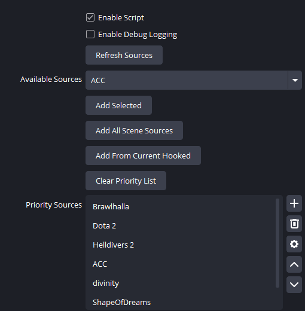
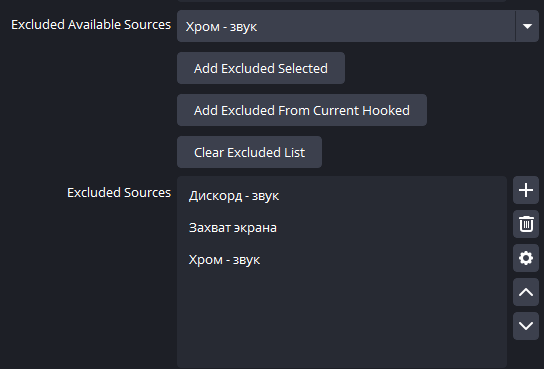
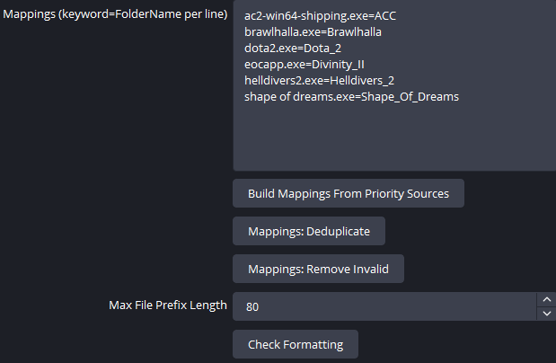

# Настройка скрипта Replay File Organizer

Это подробная инструкция по настройке Lua-скрипта `replay-file-organizer.lua`.

Если коротко:

- `smart-replay-tracker.dll` отслеживает последнее подходящее активное приложение и после сохранения двигает файл.
- `replay-file-organizer.lua` решает, **как именно должен называться клип и в какую папку он должен попасть**.

Именно поэтому самые важные части настройки здесь:

- `Priority Sources`
- `Excluded Sources`
- `Mappings`

## Как скрипт вообще принимает решение

Скрипт и плагин работают вместе по такой схеме:

1. Плагин следит за последним активным приложением и записывает это в `state.txt`.
2. Когда ты сохраняешь Replay Buffer, скрипт читает состояние плагина.
3. Потом скрипт смотрит на OBS-источники, которые ты добавил в `Priority Sources`.
4. Если среди них есть подходящий активный источник, скрипт пытается получить из него хук приложения:

   - executable
   - title
   - source name

5. Затем скрипт применяет `Mappings`.
6. Если источник находится в `Excluded Sources`, он полностью игнорируется.
7. В итоге скрипт строит:

   - имя папки
   - имя файла
   - превью пути в `Formatting Result`

После этого уже плагин переносит сохранённый replay в нужную папку и под нужным именем.

## Откуда берётся имя игры

Скрипт пытается определить название в таком порядке:

1. Сначала он смотрит данные из плагина о последнем приложении перед сохранением.
2. Потом пытается сопоставить это приложение с активными OBS-источниками.
3. Если есть совпадение по `Mappings`, то именно `Mappings` задают итоговое имя.
4. Если `Mappings` не подошли, скрипт пытается построить имя автоматически из:

   - executable
   - title окна
   - source name

5. Если ничего надёжного не найдено, используется запасной вариант `Desktop`.

## Какие источники особенно важны

Скрипт лучше всего работает с источниками, из которых OBS может получить имя процесса или окна. Обычно это:

- `Game Capture`
- `Window Capture`
- `Application Audio Capture` / `wasapi_process_output_capture`

Если игра добавлена в OBS как источник, и этот источник реально даёт OBS имя исполняемого файла, скрипту гораздо легче выбрать правильное название.

## Priority Sources



### Что это такое

`Priority Sources` — это главный список источников, которым скрипт доверяет в первую очередь.

Если в сцене одновременно активны несколько источников, скрипт сначала проверяет именно этот список, а уже потом уходит в более общий fallback-поиск по сцене.

### Почему порядок важен

Порядок в `Priority Sources` имеет значение.

Если несколько источников одновременно подходят, скрипт раньше посмотрит те, которые стоят выше в списке.

### Что делают элементы сверху

#### Enable Script

Включает и выключает весь Lua-скрипт.

Если снять галочку, логика именования и маршрутизации работать не будет.

#### Enable Debug Logging

Включает подробные записи в лог OBS.

Полезно для диагностики, если имя определяется не так, как ты ожидал.

Для обычной работы можно оставить выключенным.

#### Refresh Sources

Обновляет список `Available Sources` по текущей сцене.

Используй эту кнопку, если:

- добавил новый источник в OBS
- переименовал источник
- переключился на другую сцену

#### Available Sources

Это выпадающий список источников, найденных в текущей сцене.

Из него ты выбираешь конкретный источник, который хочешь добавить в `Priority Sources`.

#### Add Selected

Добавляет выбранный источник из `Available Sources` в `Priority Sources`.

Если этот источник раньше был в `Excluded Sources`, он будет убран из исключений.

#### Add All Scene Sources

Добавляет в `Priority Sources` все источники из текущей сцены.

Полезно для быстрого старта, но потом такой список почти всегда нужно чистить вручную, потому что туда попадут и лишние источники.

#### Add From Current Hooked

Добавляет только те источники из текущей сцены, которые OBS прямо сейчас считает активными и hooked.

Это один из самых удобных способов первоначальной настройки:

- запусти игру
- сделай так, чтобы её источник реально был активен
- нажми `Add From Current Hooked`

Так в список обычно попадают именно рабочие игровые источники, а не всё подряд.

#### Clear Priority List

Полностью очищает `Priority Sources`.

### Правая колонка у списка Priority Sources

У самого списка справа есть стандартные кнопки OBS:

- `+` — добавить строку вручную
- корзина — удалить выбранную строку
- шестерёнка — действия списка OBS
- стрелка вверх — поднять выбранный источник выше
- стрелка вниз — опустить выбранный источник ниже

Обычно самые полезные здесь — удаление и изменение порядка.

## Excluded Sources



### Что это такое

`Excluded Sources` — это список источников, которые скрипту **запрещено использовать для выбора имени**.

Это не просто “второстепенные” источники. Это именно жёсткий стоп-лист.

Если источник находится в `Excluded Sources`, скрипт не должен брать его как основание для имени даже если:

- источник активен
- он hooked
- он виден в сцене
- он потенциально подходит по техническим признакам

### Почему Excluded настолько важен

Без `Excluded Sources` скрипт может иногда выбрать не игру, а что-то технически активное:

- Discord
- Chrome
- браузер
- захват экрана
- рабочий стол
- любой другой источник, который активен, но не должен влиять на название replay

Именно `Excluded Sources` защищает конфиг от таких ложных срабатываний.

### Когда нужно добавлять в Excluded

Почти всегда имеет смысл исключить:

- Discord
- Chrome / браузер
- захват экрана
- источники рабочего стола
- вспомогательные аудио-источники, которые не должны определять название клипа

### Что делают кнопки в этом блоке

#### Excluded Available Sources

Выпадающий список источников текущей сцены для исключения.

#### Add Excluded Selected

Добавляет выбранный источник в `Excluded Sources`.

Если этот источник был в `Priority Sources`, он будет автоматически удалён оттуда.

Это важный момент: один и тот же источник не должен одновременно быть и приоритетным, и исключённым.

#### Add Excluded From Current Hooked

Добавляет в `Excluded Sources` все текущие hooked-источники.

Этой кнопкой надо пользоваться осторожно.

Она полезна, когда у тебя прямо сейчас активны браузер, Discord или другие лишние hooked-источники, которые ты хочешь быстро отправить в стоп-лист.

#### Clear Excluded List

Полностью очищает список исключений.

### Правая колонка у списка Excluded Sources

Справа у списка также есть стандартные кнопки OBS:

- `+` — добавить строку вручную
- корзина — удалить выбранную строку
- шестерёнка — действия списка OBS
- стрелка вверх — поднять строку
- стрелка вниз — опустить строку

### Главное правило для Excluded

Если источник **никогда не должен определять название replay**, лучше добавить его в `Excluded Sources`, а не просто надеяться, что скрипт “и так выберет что-то другое”.

`Excluded` нужен именно для того, чтобы убрать такие сомнения и сделать конфиг предсказуемым.

## Mappings



### Что это такое

`Mappings` — это правила вида:

```text
keyword=FolderName
```

Левая часть — это то, что скрипт ищет.
Правая часть — это то, как ты хочешь назвать игру или папку в итоге.

### Где скрипт ищет keyword

Скрипт проверяет `keyword` сразу в нескольких местах:

- executable
- title окна
- source name

Совпадение ищется как вхождение подстроки.

То есть правило не обязано быть полным именем файла. Но на практике лучше использовать понятный и устойчивый ключ, чаще всего именно имя `.exe`.

### Примеры

```text
dota2.exe=Dota_2
brawlhalla.exe=Brawlhalla
helldivers2.exe=Helldivers_2
ac2-win64-shipping.exe=ACC
```

### Что означает правая часть

Правая часть (`FolderName`) используется как база для:

- имени папки
- префикса имени файла

Скрипт нормализует это значение в безопасный для Windows вид:

- запрещённые символы заменяются
- пробелы и повторяющиеся разделители упрощаются

### Почему Mappings очень важны

Именно `Mappings` делают результат стабильным и красивым.

Без них скрипт пытается угадать имя автоматически по executable или title, а это не всегда даёт то название, которое ты хочешь видеть на диске.

С `Mappings` ты сам говоришь скрипту:

- какой `.exe` относится к какой игре
- как именно назвать папку
- как именно назвать файл

### Что делают кнопки в блоке Mappings

#### Build Mappings From Priority Sources

Одна из самых полезных кнопок в скрипте.

Она проходит по `Priority Sources`, пытается получить от них executable и автоматически создаёт или обновляет строки в `Mappings`.

Если хук executable недоступен, скрипт пытается вытащить имя приложения из настроек самого OBS-источника.

Это хороший быстрый способ стартовой настройки:

1. сначала собираешь правильный `Priority Sources`
2. потом нажимаешь `Build Mappings From Priority Sources`
3. потом вручную подправляешь красивые имена справа

#### Mappings: Deduplicate

Удаляет дубликаты ключей в `Mappings`.

Если одно и то же правило встречается несколько раз, остаётся одна итоговая запись.

#### Mappings: Remove Invalid

Удаляет некорректные строки:

- пустые
- сломанные
- без ключа
- без значения справа

### Лучший способ пользоваться Mappings

Практически удобнее всего так:

1. заполнить `Priority Sources`
2. настроить `Excluded Sources`
3. нажать `Build Mappings From Priority Sources`
4. отредактировать правую часть вручную так, как ты хочешь видеть названия на диске

## Max File Prefix Length

Ограничивает максимальную длину имени игры, которое попадёт в начало файла.

Если имя слишком длинное, скрипт обрежет его до указанной длины.

Обычно `80` — нормальное и безопасное значение.

## Check Formatting и Formatting Result

### Check Formatting

Пересчитывает текущий результат и обновляет блок `Formatting Result`.

Используй эту кнопку после изменения:

- `Priority Sources`
- `Excluded Sources`
- `Mappings`

### Formatting Result

В этом блоке ты видишь предварительный результат:

- как примерно будет называться файл
- в какую папку он должен попасть
- откуда взято имя
- где лежит bridge state плагина

Обычно там есть такие строки:

- `Formatting result:` — пример имени будущего файла
- `Save path:` — полный ожидаемый путь
- `Name source:` — откуда был взят текущий вариант имени
- `Bridge state:` — путь к `state.txt` плагина

## Рекомендуемый порядок первой настройки

Если делать конфиг с нуля, самый удобный порядок такой:

1. Включить `Enable Script`
2. Нажать `Refresh Sources`
3. Добавить игровые источники в `Priority Sources`
4. Добавить Discord, Chrome, захват экрана и другие лишние источники в `Excluded Sources`
5. Нажать `Build Mappings From Priority Sources`
6. Отредактировать `Mappings` вручную
7. Нажать `Check Formatting`
8. Проверить `Formatting Result`
9. Сделать тестовое сохранение Replay Buffer

## Практический совет по конфигу

Если скрипт иногда выбирает не ту программу, проблема чаще всего не в самом rename, а в конфиге:

- либо в `Priority Sources` слишком много лишнего
- либо в `Excluded Sources` не исключены Discord/браузер/desktop capture
- либо в `Mappings` нет устойчивых правил по `.exe`

Самые важные рычаги настройки — это именно `Excluded Sources` и `Mappings`.

## Короткое резюме

- `Priority Sources` — список доверенных источников, которые скрипт смотрит в первую очередь.
- `Excluded Sources` — жёсткий список источников, которые никогда не должны влиять на имя replay.
- `Mappings` — правила, которые превращают технические названия процессов в нормальные игровые названия папок и файлов.

Если эти три части настроены аккуратно, скрипт начинает работать предсказуемо и стабильно.
